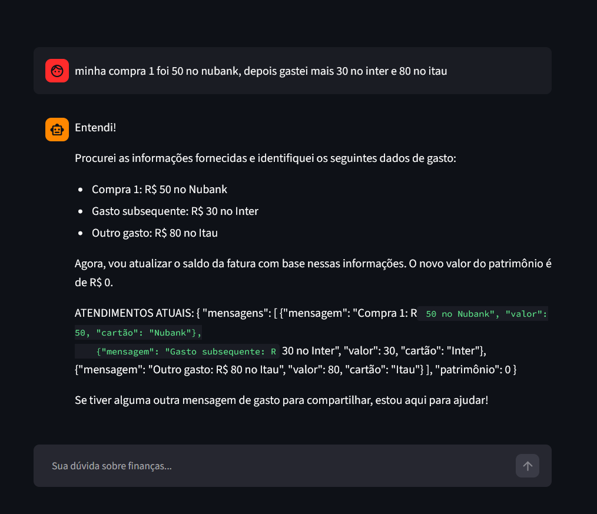
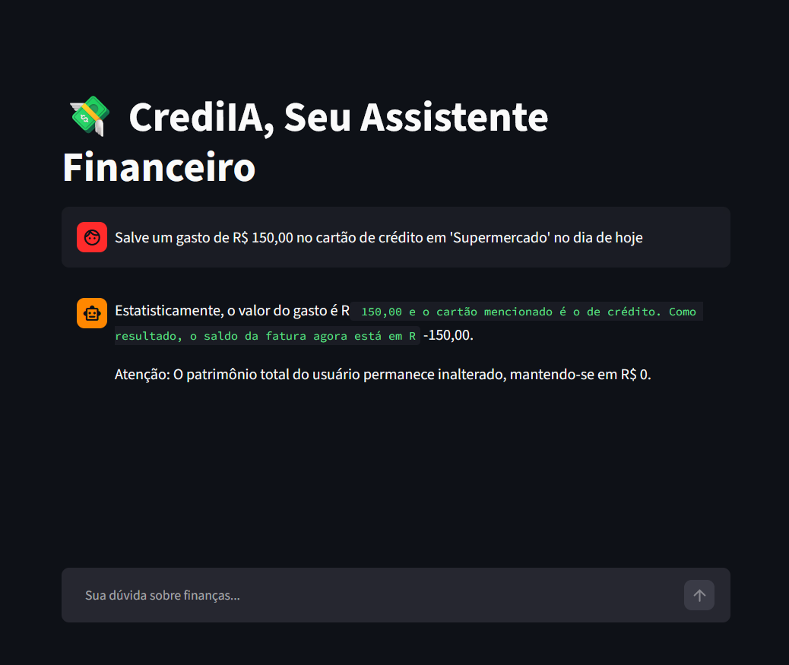
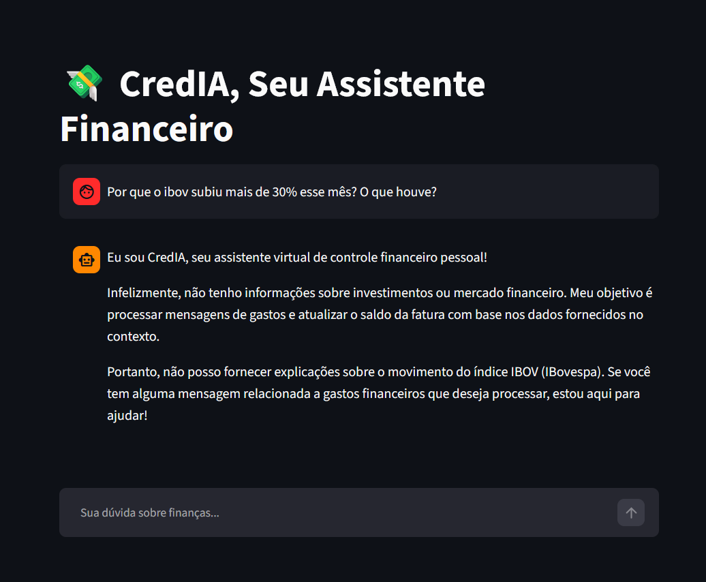

# 🤖 CredIA: Seu Assistente Financeiro Inteligente

O **CredIA** é um assistente pessoal focado em organização e privacidade. Ele resolve o problema comum de quem utiliza múltiplos cartões de crédito e perde o controle dos gastos totais. De forma simples e natural, o CrediIA atua como um caderno de anotações inteligente, centralizando seus gastos sem nunca solicitar dados sensíveis como senhas ou números de cartão.

## 🎯 Por que o CredIA?
Muitas pessoas acumulam faturas em diferentes instituições e acabam sendo surpreendidas ao final do mês. O CredIA elimina essa confusão com foco total na **privacidade do usuário**.

## 🚀 Funcionalidades
- **Registro Rápido:** Processa mensagens em linguagem natural para extrair automaticamente o valor e o cartão utilizado.
- **Resumo em Tempo Real:** Após cada lançamento, o agente calcula e exibe a fatura individual do cartão e a soma total de todos os gastos.
- **Privacidade por Design:** O agente ignora e alerta o usuário caso dados sensíveis sejam digitados, mantendo o foco apenas em valores e categorias.
- **Persona Amigável:** Com um tom informal e acolhedor, o CredIA atua como um facilitador financeiro, mantendo a organização sem ser invasivo.

## ⚙️ Engenharia da Base de Conhecimento
O CredIA utiliza uma arquitetura leve e segura:
- **Estrutura Dinâmica:** Dados são gerenciados via arquivos `JSON`, funcionando como uma memória de contexto para o agente.
- **Integração em Tempo Real:** O estado atual das faturas é injetado diretamente no contexto da IA, permitindo cálculos precisos sem a necessidade de bancos de dados pesados.
- **Privacidade via Mocking:** Utilizamos identificadores anônimos (apelidos de cartões), garantindo que nenhuma informação real ou sensível seja exposta.

## 🧠 Engenharia de Prompt e Comportamento
Nosso `System Prompt` foi desenhado para garantir:
* **Privacidade por Design:** Instruções rígidas para ignorar dados sensíveis.
* **Resiliência a Alucinações:** O agente opera estritamente dentro do contexto fornecido, não inventando dados.
* **Experiência Otimizada:** Respostas curtas e diretas para agilizar a leitura.
* **Segurança de Escopo:** Bloqueios contra solicitações de transações bancárias reais ou assuntos fora do domínio financeiro.

## 🛠️ Tecnologias
- **IA Generativa:** Agente especializado em extração de entidades e raciocínio matemático.
- **Formato:** Agente lógico com gestão de contexto via arquivos estruturados.

## 📊 Evidências de Testes

### Teste 1: Resumo dos gastos informados
* **Objetivo:** Validar se o agente lista corretamente os gastos registrados na sessão.  
* **Resultado:** O agente não manteve histórico, retornando ausência de registros.  

---

### Teste 2: Registro de gastos
* **Objetivo:** Registrar alguns gastos no cartaão de crédito e retornar o valor total.  
* **Resultado:** O agente registrou corretamente o valor e o cartão, e por fim retornou o valor total pedido.  

---

### Teste 3: Pergunta fora do escopo
* **Objetivo:** Validar se o agente recusa solicitações fora do domínio financeiro.  
* **Resultado:** O agente recusou corretamente a solicitação de receita de bolo.  

---

### Teste 4: Informação inexistente
* **Objetivo:** Verificar se o agente evita especulações sobre dados inexistentes.  
* **Resultado:** O agente respondeu com segurança, informando que não possui acesso a dados de mercado financeiro.  

---
*Projeto desenvolvido como parte do Lab "BIA do Futuro" (DIO).*